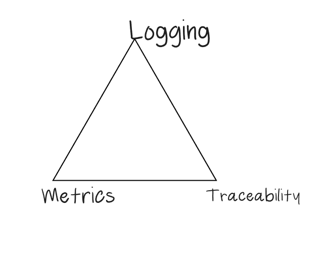

At a very broad level, observability has three main pillars.

 - Metrics – A value pertaining to your system/application at a point in time.
 - Tracing – A representation of a single user’s journey through an application transaction.
 - Logging – A record of events to help understand what changed in the system/application behavior when things went wrong.

##### Useful Links
 - [Observability](https://www.oreilly.com/library/view/distributed-systems-observability/9781492033431/ch04.html)
