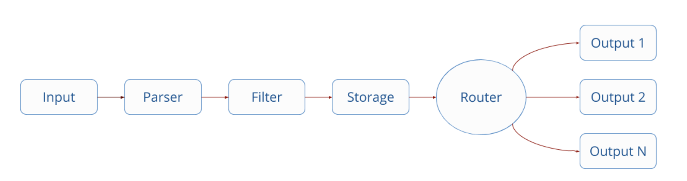
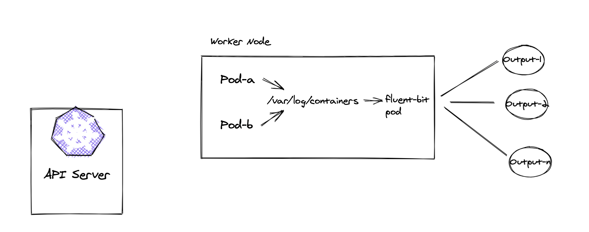
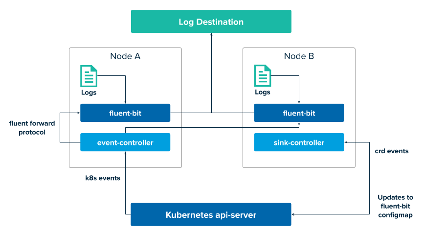

# PKS Logging with Syslog

## Table of Contents
- [Application Logging Recommended Approach](#application-logging-12-factor-approach)
- [Routing Application Logs](#log-routing-with-fluent-bit)
- [PKS Logging](#pks-logging)
    - [Individual K8s namespaces within a cluster](#individual-k8s-namespaces-within-a-cluster)
    - [Individual K8s Clusters](#individual-k8s-clusters)
    - [PKS Control Plane](#pks-control-plane)
    - [BOSH Director and its Components](#bosh-director-and-its-components)
    - [Useful Links](#useful-links)

### Application Logging - 12 factor approach

 - Treat Logs as streams.
 - Managing the output and routing of logs falls outside the application domain.

### Log Routing with fluentbit

*"Fluent Bit is an open source Log Processor and Forwarder which allows you to collect any data like metrics and logs from different sources, enrich them with filters and send them to multiple destinations."*

#### Fluentbit processing steps



#### Fluentbit in K8S



#### Fluentbit in TKGI



### TKGI Logging

TKGI logging can be enabled and configured at 4 different levels:

1. Individual K8s namespaces within a cluster
2. Individual K8s clusters
3. PKS Control plane
4. BOSH Director and its components

For this lab, we will use the [Papertrail](https://papertrailapp.com) syslog application. Users can bring their own logging systems that follow the syslog protocol.

The following information will be required:

* Syslog endpoint - `logsx.papertrailapp.com` for this lab
* Syslog port - `4423` for this lab
* TLS enabled/disabled - `Enabled` for this lab.
* `Enable Log Sink Resources` should be enabled on the PKS tile.

#### Application Logging

##### Individual K8s Namespaces within a Cluster

Deploy an application

```execute
kubectl create deployment hello-java --image=securezone/helloworld-java-spring
```

Create a yaml file `sink.yaml` with the following contents:

```copy
apiVersion: pksapi.io/v1beta1
kind: LogSink
metadata:
  name: sink-papertrail
spec:
  type: http
  output_properties:
    Host: logsx.papertrailapp.com
    #Format: json
    Port: 4423
    tls: on
    tls.verify: off
```

where `name` is the name of your Sink resource, `host` is the syslog host, `port` is the syslog port and `enable_tls` enables TLS communication.

```execute
kubectl apply -f sink.yaml
```

This should create the required Sink resource for the Namespace `kube-system`.

Navigate to your Syslog dashboard and look for relevant logs in your Syslog dashboard.

##### Individual K8s Clusters

Create a yaml file `clustersink.yaml` with the following contents:

```copy
apiVersion: pksapi.io/v1beta1
kind: ClusterLogSink
metadata:
  name: cluster-sink-papertrail
spec:
  type: http
  output_properties:
    Host: logsx.papertrailapp.com
    #Format: json
    Port: 4423
    tls: on
    tls.verify: off
```

```execute
`kubectl apply -f clustersink.yaml`
```

This should create the required ClusterSink resource.

Navigate to your Syslog dashboard and look for relevant logs in your Syslog dashboard

#### Platform Logging

##### PKS Control Plane

To enable logging of the PKS control plane, within the OpsMan UI, navigate to the PKS tile -> `Settings` -> `Logging`.

The following information needs to be entered:

- `Enable Syslog for PKS?` - `Yes`
- `Address` -`logs3.papertrailapp.com`
- `Port` - `39458`
- `Transport Protocol` - `TCP`
- `Enable TLS` - Checked if the logging app allows TLS.
- `Save` the changes

Navigate to the top level. `Review Pending Changes` and then `Apply Changes`.

Navigate to your Syslog dashboard and look for relevant logs in your Syslog dashboard.

##### BOSH Director and its Components

To enable logging of the BOSH director and its components, within the OpsMan UI, navigate to the BOSH Director tile -> `Settings` -> `Syslog`.

The following information needs to be entered:

- `Do you want to configure Syslog for Bosh Director?` - `Yes`
- `Address` -`logs3.papertrailapp.com`
- `Port` - `39458`
- `Transport Protocol` - `TCP`
- `Enable TLS` - Checked if the logging app allows TLS
- `Save Syslog Settings` the changes.

Navigate to the top level. `Review Pending Changes` and then `Apply Changes`.

Navigate to your Syslog dashboard and look for relevant logs in your Syslog dashboard.

### Useful Links
 - [12 factor apps](https://12factor.net/)
 - [Fluentbit](https://docs.fluentbit.io/manual/)
 - [Fluentbit output plugins](https://docs.fluentbit.io/manual/pipeline/outputs)
 - [Sink Architecture](https://docs.pivotal.io/tkgi/1-10/sink-architecture.html)
 - [Creating Sinks](https://docs.pivotal.io/tkgi/1-10/create-sinks.html)
