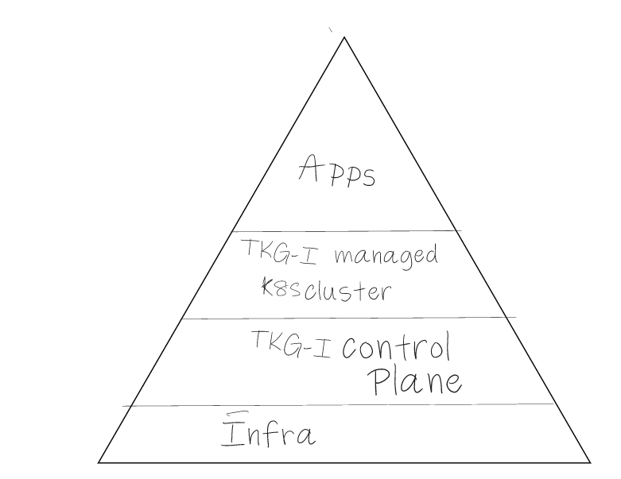
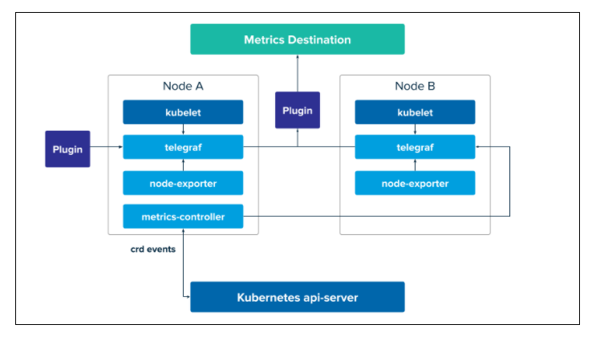
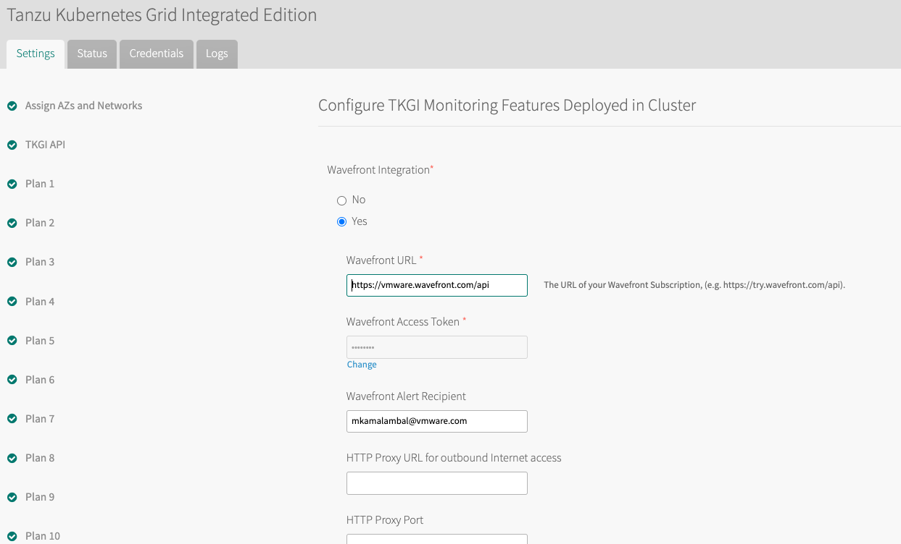

# TKGI - Metrics and Traceability

## Table of Contents
- [TKGI Monitoring Layers](#tkgi-monitoring-layers)
- [TKGI Workload Monitoring](#tkgi-workload-monitoring)
    - [Metrics Sink Resources](#metrics-sink-resources)
    - [Wavefront Integration](#wavefront-integration)
    - [vRealize Operations](#vRealize-operations)

### TKGI Monitoring Layers



### TKGI Workload Monitoring

In order to monitor workloads running in TKGI clusters, the following options are avalable.

1. Sink Resources (TKGI Component)
2. Wavefront (External Integration)
3. vRealize Operations (External Integration)

#### Metrics Sink Resources

The TKGI metric sink aggregates workload metrics and forwards them to a common metrics destination.
The metric sink can be created either at a namespace or cluster level.



A metric sink collects and writes metrics from a cluster to specified outputs using input and output plugins.

##### Individual K8s Namespaces within a Cluster

Create a yaml file `metricsink.yaml` with the following contents:

```copy
apiVersion: pksapi.io/v1beta1
kind: MetricSink
metadata:
  name: datadog-metric-sink
  namespace: spring-petclinic
spec:
  inputs:
  outputs:
  - type: datadog
    apiKey: xxxxxxxxx
```

```execute
kubectl apply -f metricsink.yaml
```

This will create the required Sink resource for the namespace `spring-petclinic`.

##### Individual K8s Cluster

Create a yaml file `clustermetricsink.yaml` with the following contents:

```copy
apiVersion: pksapi.io/v1beta1
kind: ClusterMetricSink
metadata:
  name: datadog-sink
spec:
  inputs:
  - monitor_kubernetes_pods: true
    type: prometheus
  outputs:
  - type: datadog
    apiKey: xxxx
```

```execute
kubectl apply -f clustermetricsink.yaml
```
#### Wavefront 

Wavefront integration can be enabled at the platform level by configuring the TKGI tile in Opsman.


When you enable this integration, a wavefront collector will be deployed to all Kubernetes clusters created via TKGI.
The Wavefront Collector for Kubernetes is an agent that runs as a DaemonSet on each node within a Kubernetes cluster. It collects metrics and events about the cluster and sends them to the Wavefront SaaS service. 

The wavefront collector can collect data from multiple sources,

 - Kubernetes (kubelet) source: For core kubernetes metrics
 - Prometheus source: For scraping prometheus metric endpoints (API server, etcd, NGINX etc)
 - Kubernetes state source: For resource state metrics
 - Telegraf source: For host and application level metrics
 - Systemd source: For host level systemd metrics

##### Kubernetes Metrics with Wavefront.

##### Application Metrics with Wavefront.

##### Application Tracing with Wavefront.

##### Alerting with Wavefront.

#### vRealize Operations


### Useful Links
 - [Sink Architecture](https://docs.pivotal.io/tkgi/1-10/sink-architecture.html)
 - [Creating Sinks](https://docs.pivotal.io/tkgi/1-10/create-sinks.html)
 - [Telegraf](https://docs.fluentbit.io/manual/)
 - [Telegraf input plugins](https://docs.fluentbit.io/manual/pipeline/outputs)
 - [Telegraf output plugins](https://github.com/influxdata/telegraf/tree/1.13.4#output-plugins)
 - [Configuring Telegraf in TKGI](https://docs.pivotal.io/tkgi/1-10/monitor-etcd.html)
 - [Wavefront Collector Metrics](https://github.com/wavefrontHQ/wavefront-collector-for-kubernetes/blob/master/docs/metrics.md)
