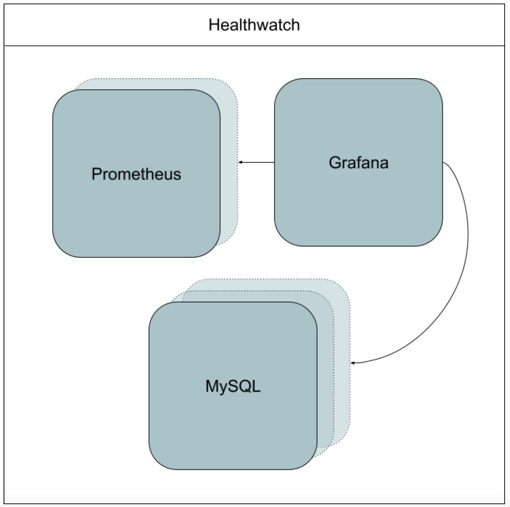

# TKGI - Metrics With Healthwatch 2.0

## Table of Contents
- [Healthwatch 2.0](#healthwatch-2.0)
    - [Healthwatch Architecture](#healthwatch-architecture)
    - [Healthwatch Exporter](#healthwatch-exporter)

### Healthwatch 2.0

The Healthwatch tile gathers metrics across multiple Ops Manager foundations by scraping them from Healthwatch Exporter tiles installed on each foundation.

Healthwatch deploys instances of Prometheus and Grafana. The Prometheus instance scrapes and stores metrics from the Healthwatch Exporter tiles and enables you to configure alerts with Alertmanager.

Healthwatch then exports the collected metrics to dashboards in Grafana, enabling you to visualize the data with charts and graphs and create customized dashboards for long-term monitoring and troubleshooting.

### Healthwatch Architecture

#### Prometheus:

Scrapes /metrics endpoints for Healthwatch Exporter tiles, collecting metrics related to the functionality of platform- and runtime-level components that include the following:
  - Service level indicators (SLIs) for the BOSH Director
  - SLIs for TKGI components
  - When Ops Manager certificates are due to expire
  - BOSH system metrics for TKGI
   VMs deployed by Healthwatch Exporter tiles
  - Stores metrics for up to six weeks
  - Can write to remote storage in addition to its local TSDB

#### Grafana:

Enables you to visualize the collected metrics data in charts and graphs, as well as create customized dashboards for easier monitoring and troubleshooting

#### Alertmanager:

Manages and sends alerts according to the alerting rules you configure

### Healthwatch Exporter

The Healthwatch Exporter for TKGI tile deploys metric exporter VMs to generate SLIs related to the health of your TKGI deployment.

The Prometheus VM that exists within your metrics monitoring system then scrapes the Prometheus exposition endpoints on the metric exporter VMs and imports those metrics into your monitoring system.

Healthwatch Exporter for TKGI exposes the following metrics related to the functionality of TKGI components and the Healthwatch Exporter for TKGI tile:

  - SLIs for TKGI components
  - BOSH system metrics for TKGI
  - VMs deployed by Healthwatch Exporter for TKGI

### Useful Links
 - [HealthWatch Architecture](https://docs.pivotal.io/healthwatch/2-0/architecture.html)
