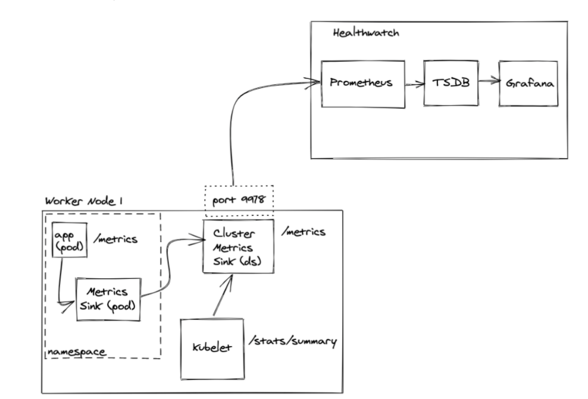

# TKGI - App Metrics With Healthwatch 2.0

This section includes a few examples on how to leverage the PKS Sink architecture to collect custom application metrics, expose them in a single prometheus endpoint in a TKGI k8s cluster, and scrap them by an external prometheus instance running in Healthwatch 2.0.

## Table of Contents
- [Architecture](#architecture)
    - [Healthwatch Architecture](#healthwatch-architecture)
    - [Healthwatch Exporter](#healthwatch-exporter)

### Architecture

This example sets up a cluster metric sink(CMS) and a metric sink(MS). The MS is to capture custom metrics from prometheus annotated pods in the namespace and forward those metrics to the CMS. The CMS will then expose all aggregated metrics on a single prometheus /metrics enpoint. This makes it use the built in discovery to aggregate metrics that can be scraped by an external prometheus instance.

We setup the CMS with a influxdb_listener input. The MS in the namespace then can have a influxdb output that send metric to the CMS influxdb listener. It also requires a service to be set up on the CMS so that the MS can use k8s dns to resolve the listener. We also need to enable a prometheus output on the CMS.

The last piece is to configure Healthwatch 2.0 to scrap these metrics.





#### Steps:

 - Create a yaml file cms-prometheus.yml
```editor:open-file
file: ./cms-prometheus.yml
```
 - Create a yaml telegrafds-service.yml for the service to expose the cluster metric sink.
```editor:open-file
file: ./telegrafds-service.yml
```
 - Install the cluster metric sink and service
```execute
kubectl apply -f cms-prometheus.yml
kubectl apply -f telegrafds-service.yml
```
 - Create a yaml file ms-influxdb.yml for the metric sink at namespace level.
```editor:open-file
file: ./ms-influxdb.yml
```
 - Install the metric sink into default namespace
```execute
kubectl apply -f ms-influxdb.yml
```
 - Create a yaml file app-sample-metrics.yml to deploy a sample app that emits metrics.
```editor:open-file
file: ./app-sample-metrics.yml
```
 - Run the example app pod and expose it
```execute
kubectl apply -f app-sample-metrics.yml
```
Change from NodePort to LoadBalancer if your cluster allows it.

 - Visit the app on the /metrics endpoint; the counter will increase as you refresh

 - Visit the Prometheus client running on the worker node on port 9978 and you should see the metrics from the example app. This /metrics endpoint can now be scraped by any Prometheus instance.

#### Adding in Healthwatch 2.0:

You can now view these metrics in the bundled Grafana UI from Healthwatch 2.0. The only requirement being that you configured the Prometheus Configuration setting in the tile to have the following custom Scrape Config Job:

```copy
echo "job_name: cluster_metric_sinks
dns_sd_configs:
- names:
    - q-s4.worker.*.*.bosh.
  type: A
  port: 9978"
```


### Useful Links
 - [Source Credit](https://github.com/jaimegag/pks-zone/tree/master/sinks)
 - [Bosh DNS Queries](https://bosh.io/docs/dns/#constructing-queries)